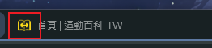

# 首頁設定

針對首頁顯示內容的各項操作設定，包含網站標題、Logo、icon、社群分享、Footer 的內容皆可以自訂。
從側邊攔，點選 網頁設定 展開後選擇 首頁設定進入。

## 基本資料

#### 1. 網站標題：

    對應前端網站頁面標籤上顯示的名稱
    

#### 2. 網站全域 Logo

    顯示在畫面左上角 Header 的 LOGO 圖片
    

#### 3. 網站頁標

    對應前端網站頁面標籤上顯示的 icon
    

#### 4. 行動裝置圖標

    > 參考行動裝置使用流程(待補充)。

#### 5. 應用按鈕

    :::danger 應用到前端網站
    這個頁面任何變更（包含下方社群以及聯絡資訊），按應用才會保存且應用到前端網站。
    :::

#### 6. 切換功能 Tab

    點選後可以快速跳轉到此頁面其他功能區塊，修改後要按應用才會生效。

#### 7. 多語系的個別設定功能 (待開發)

    預計之後會需要按照語系設定個別的內容，但目前尚未開發此功能。

## Footer

對應前端網站 Footer 的顯示內容

#### 01.社群設定

後台這裡可以設定要顯示在前端的社群及連結，必須勾選才會顯示。

#### 02.聯絡資訊

設定要顯示在前端的公司聯絡資訊，包含地址、電話、電子信箱等以及版權宣告。

