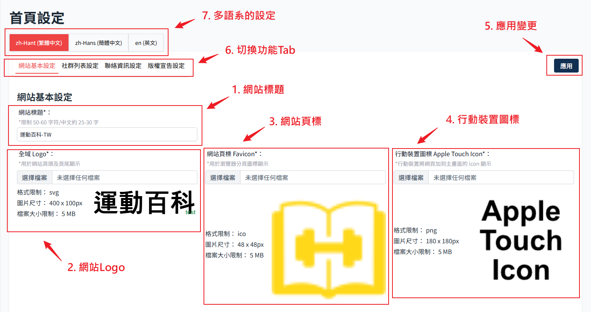

# 首頁設定

針對首頁顯示內容的各項操作設定，包含網站標題、Logo、icon、社群分享、Footer 的內容皆可以自訂。
從側邊攔，點選 網頁設定 展開後選擇 首頁設定進入。

## 基本資料

1. 網站標題

    對應前端網站頁面標籤上顯示的名稱
    

2. 網站全域 Logo
   

3. 網站頁標

4. 行動裝置圖標

5. 應用按鈕

這個頁面任何變更（包含下方社群以及聯絡資訊），按應用才會保存且應用到前端網站。

6. 切換功能 Tab

7. 多語系的個別設定功能 (待開發)

## Footer

對應前端網站設定

### 01.社群設定

後台這裡設定

### 02.聯絡資訊

