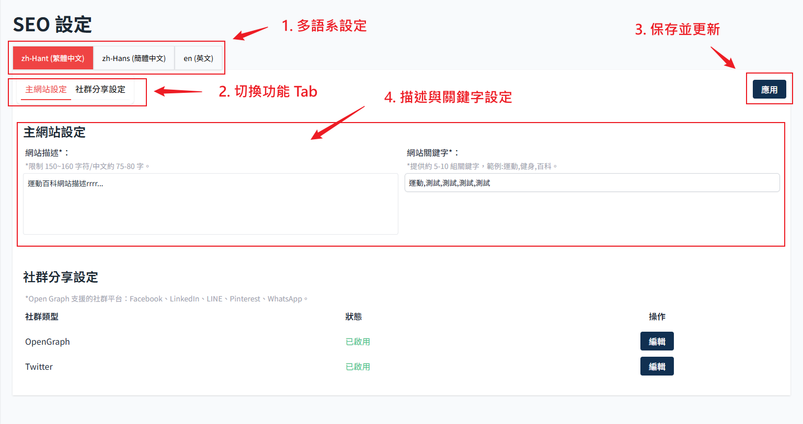
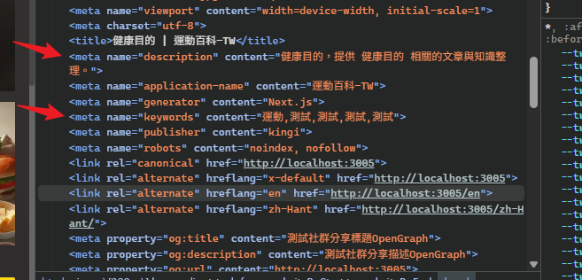
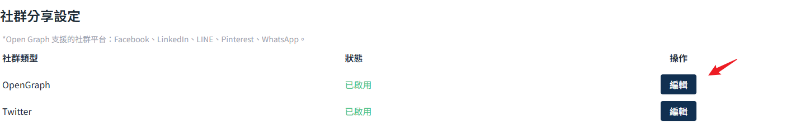
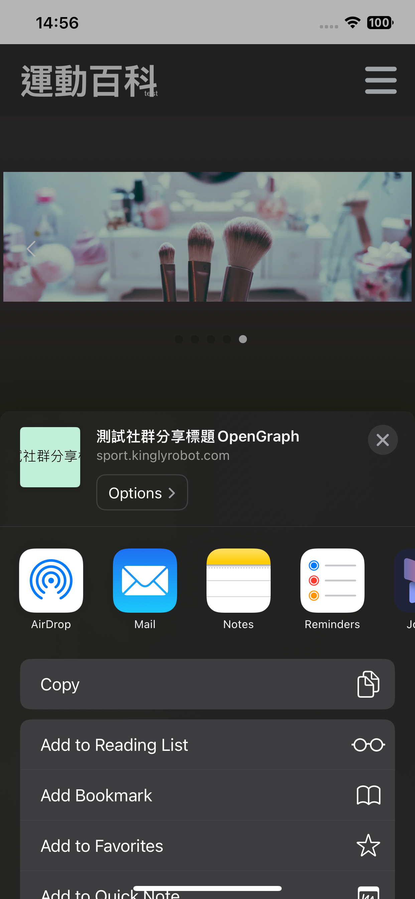
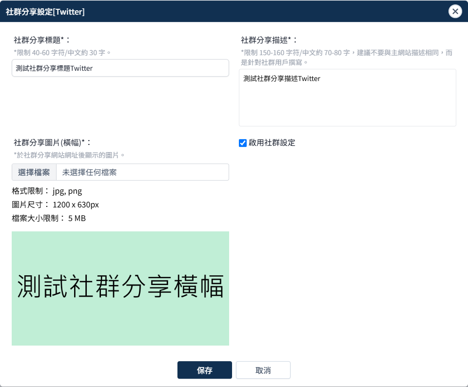

# SEO 設定

## 主網站設定

#### 1. 多語系的個別設定功能 (待開發)

預計之後會需要按照語系設定個別的內容，但目前尚未開發此功能。

#### 2. 切換功能 Tab

點選後可以快速跳轉到此頁面其他功能區塊。

#### 3. 應用按鈕

:::danger 應用到前端網站
這個頁面任何變更，按應用才會保存且應用到前端網站。
:::

#### 4. 網站描述與關鍵字更新

    

## 社群分享設定

設定分享的時候會顯示的預覽圖以及描述說明，只是因為有兩個種類，所以開兩個欄位，內容可完全設定一樣沒問題。

點選編輯後會顯示彈窗如下：

#### OpenGragh　設定

- 對應在 Line 分享連結顯示

    

- iPhone 分享顯示

    

#### Twitter　設定

