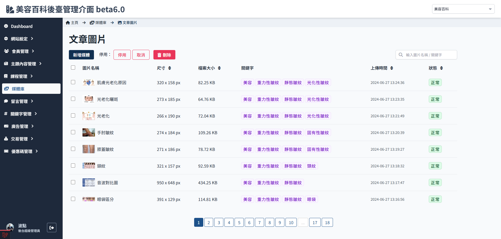
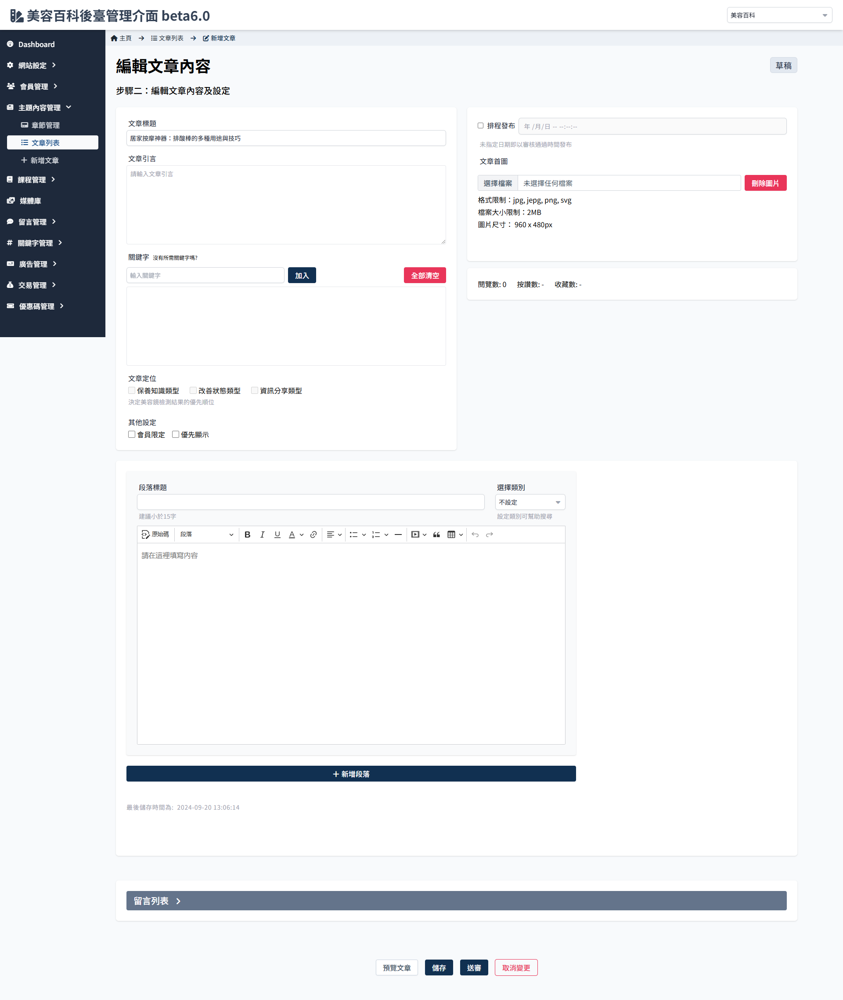

# 如何新增文章

說明新增一篇文章的詳細步驟。

> 文章狀態請參考[文章狀態與限制說明](./article-status.md)。

## 前置預備

新增文章前先預備

### 到媒體庫上傳文章配圖

> 參考[如何新增圖片至媒體庫](../media/how-to-add-img.md)

:::note 文章首圖不需要上傳媒體庫。
:::

### 確認關鍵字是否已建立

> 參考[如何新增關鍵字](../keyword/how-to-add-keywords.md)

檢查文章內關鍵字是否都已新增至關鍵字列表。

## 新增文章

上面步驟都檢查後，再開始新增文章。

### 1. 從 sidebar 點擊 新增文章

輸入文章標題，若檢測到重覆標題會無法點擊下一步

### 2. 進入文章編輯頁面

### 3. 輸入內容

新增引言、關鍵字、首圖，再依照各段落新增文章內容。詳細條件限制參閱[文章欄位條件限制](./article-content-limit.md)。

:::warning 注意事項

-   檢查各文章段落標題：不要寫得太攏統，像是症狀成因等，可以加入主題內容，像是為什麼會長青春痘等等的，這樣到時候前台使用段落類型搜索時，才不會有一堆一樣的標題。
-   表格內的換行使用 `shift` + `enter`, 避免產生表格內產生 `
` 標籤，可按原始碼檢視。
    :::

### 4. 後續操作

-   若文章已編輯完成，可點擊送審，參閱 [4-2 送審](#4-2-送審)。
-   若尚有需補充的內容，可點擊儲存草稿 [4-1 儲存草稿](#4-1-儲存草稿)。

// TODO

#### 4-1. 儲存草稿

不檢查欄位條件限制，直接記錄目前編輯狀況。

#### 4-2. 送審

會檢查所有欄位是否符合條件限制，參閱[文章欄位條件限制](./article-content-limit.md)。
