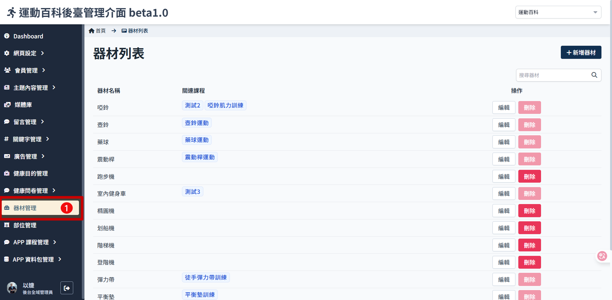
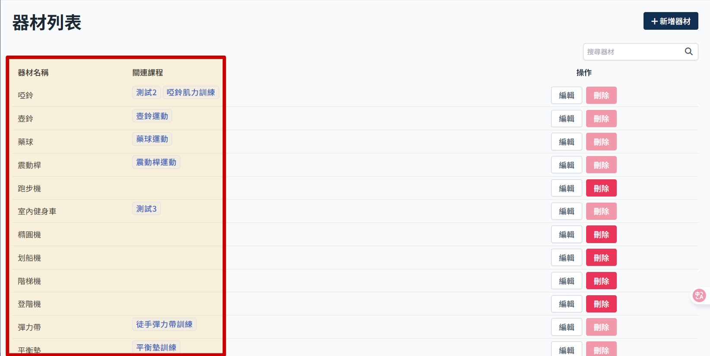
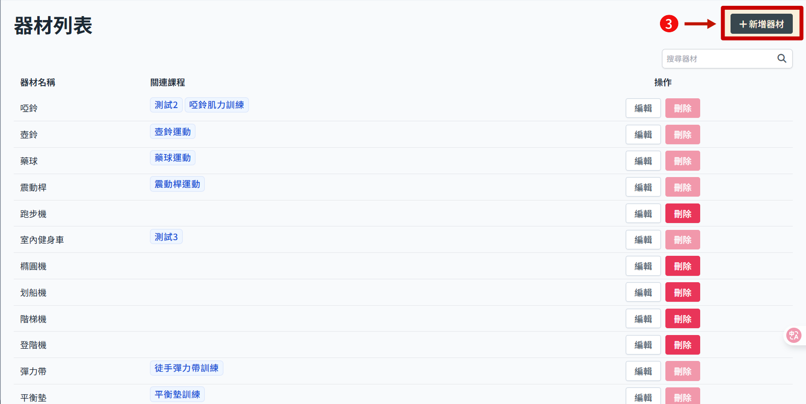
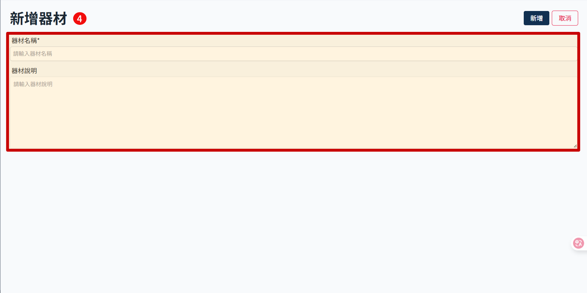
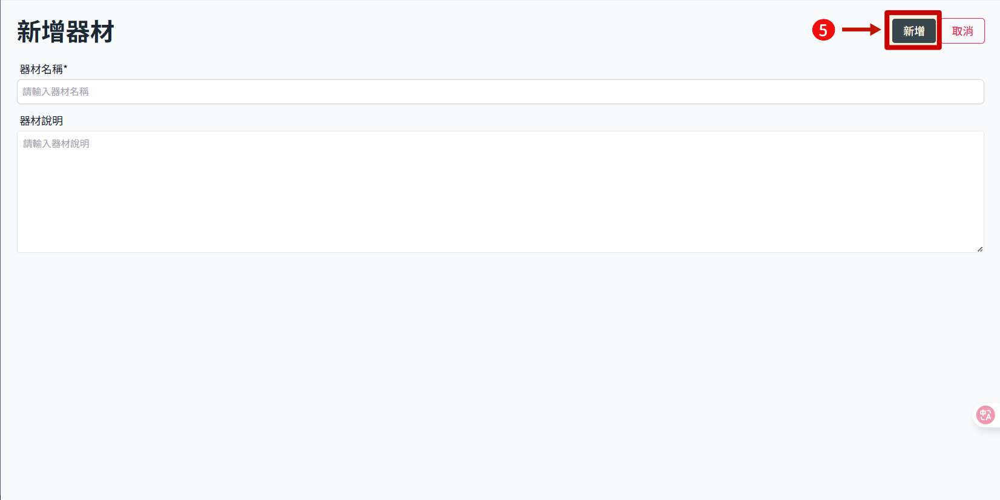
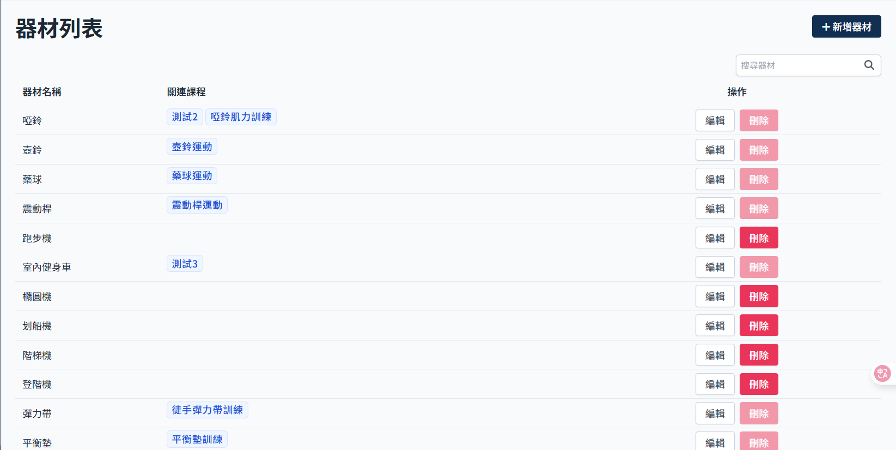

# 新增運動器材

> 器材用於課程內設定使用，主要影響篩選課程的條件。使用者如果沒有選擇器材，推薦課程時就會把有綁定該器材的課程排除。

1. 點擊側邊攔 器材管理 進入 器材列表
   
2. 部位列表顯示器材名稱及已關聯的課程
   
3. 右上角點擊 新增器材
   
4. 填寫 器材名稱/說明。注意名稱不可與已有的器材重複。
   
5. 點擊 新增
   
6. 新增成功
   
