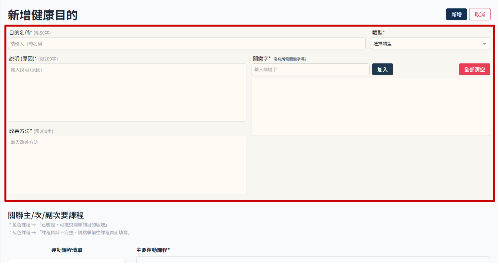
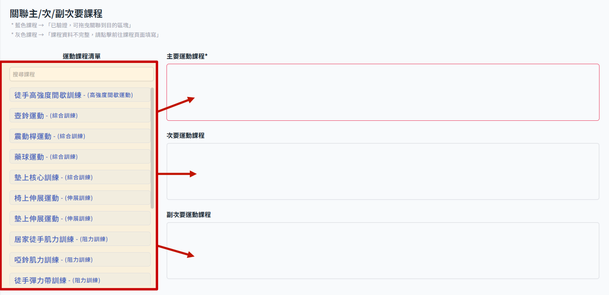

# 新增健康目的

> 先新增課程後再來操作健康目的，因為如果沒有綁定主要課程，健康目的無法正確送出。

## 操作步驟

1. 從　sidemenu　進入健康目的管理

2. 此時畫面會顯示健康目的列表，點選新增目的
   

3. 新增健康目的頁面，填寫目的說明等基本資訊
   

4. 設定關聯課程，使用拖曳方式把課程放到對應的欄位即可
   

    > 這邊涉及課程本身資料完整性，若不完整就無法設定，詳細狀態規範參考 >> [設定健康目的對應課程](set-recommend-course.md)

5. 右上角點選 新增 即完成步驟
