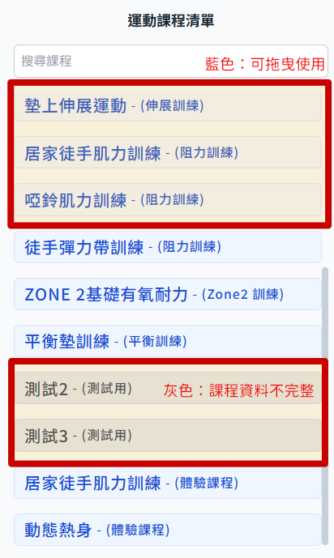
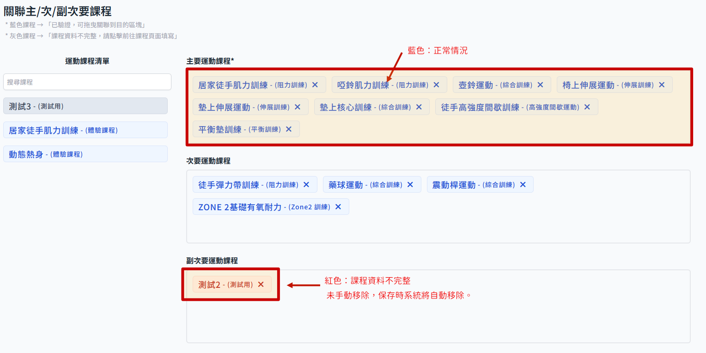

# 設定健康目的的對應課程

在新增或者編輯健康目的時，課程本身資料完整性會影響是否可以設定健康目的。

## 課程清單標示狀態說明

- 在課程清單這邊會以顏色標示是否可以拖曳設定，藍色為可以使用，灰色即代表課程資料不完整。
  

- 在編輯健康目的頁面，正常情況下都會顯示藍色，若是因為後續課程內資料異動而導致資料不完整，會顯示紅色；紅色標示的課程若沒有手動移除，會在點擊 保存變更 的時候會自動移除關聯。
  
