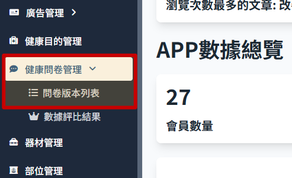

# 新增問卷版本

1.  點擊側邊攔 問卷版本列表 進入 健康問卷管理
    

2.  列表顯示
    

3.  右上角點擊 創立新的版本，下方列表即會新增一個新的問卷版本，顯示無狀態。

    > 若是已有無狀態的問卷，即無法新增成功

    

4.  點擊 問卷版本名稱，可進入問卷編輯頁面 > 只有無狀態的問卷可以編輯，其他狀態的葉面雖然可以進入編輯頁，但內容無法編輯。
    

5.  問卷編輯頁面
    
