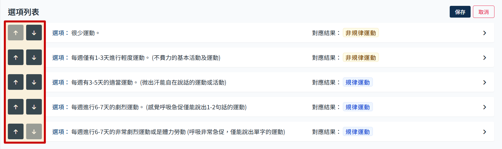

# 活動日常表現區塊

此活動區塊只有一個問題，選項部分必須要設定對應結果。

### 排序

- 點選排序
  

- 使用箭頭調整順序
  

- 點擊保存
  

### 新增選項

- 點擊 新增選項
  

- 會跳出新增選項的彈窗，填寫完後點選 新增 即可
  

### 編輯選項

- 點選選項，可展開編輯框
  

- 展開後可編輯選項名稱以及加入附加說明、設定該選項的對應結果。
  

- 編輯完成後點選保存
  
