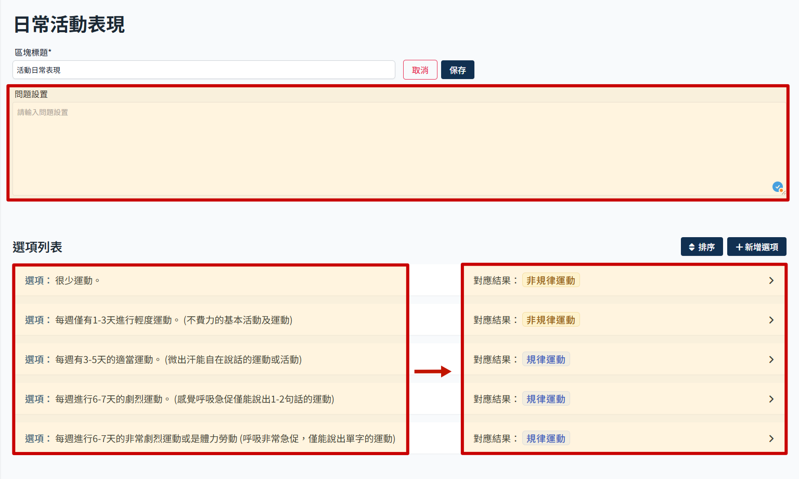
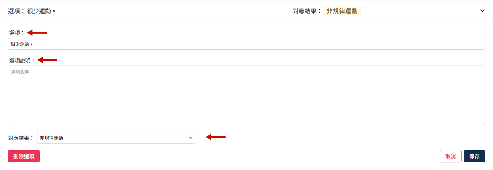
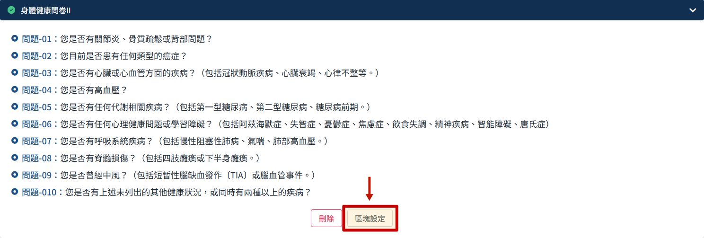
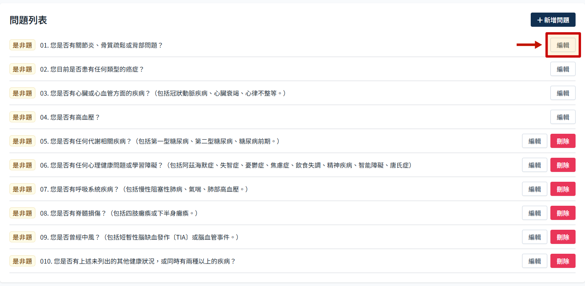
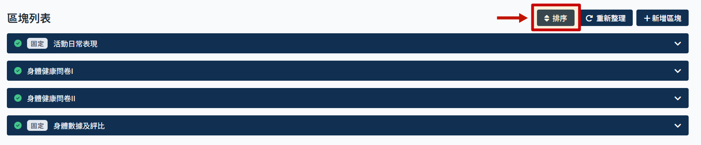
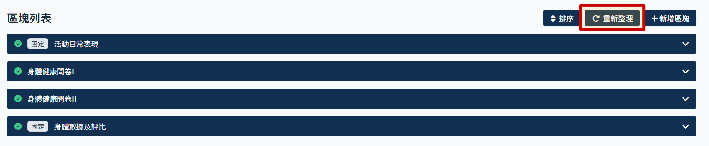

# 編輯問卷內容

> 問卷顯示無狀態的時候才可編輯問卷內容，其餘狀態只能檢視內容。參考 [健康問卷狀態說明](./questionnaire-status.md)。

點擊無狀態的問卷，進入問卷編輯頁面。

## 區塊列表設定條件及操作說明

- 問卷可添加說明，版本號及建立時間會由系統自動帶入。
- 做任何變更記得都要點選套用更新。
- 可分為三種不同類型區塊，其中活動日常表現以及身體數據為固定區塊，不可調動順序，也不可刪除，其餘區塊才可新增刪除及排序。

### 活動日常表現

此活動區塊只有一個問題，選項部分必須要設定對應結果。

#### 排序

- 點選排序
  

- 使用箭頭調整順序
  

- 點擊保存
  

#### 新增選項

- 點擊 新增選項
  

- 會跳出新增選項的彈窗，填寫完後點選 新增 即可
  

#### 編輯選項

- 點選選項，可展開編輯框
  

- 展開後可編輯選項名稱以及加入附加說明、設定該選項的對應結果。
  

- 編輯完成後點選保存
  

### 身體健康問卷（一般區塊）

身體健康問卷這個區塊即為一般類型，如果有新增區塊的話都會是這種，可以新增不同的問題類型。

- 點選區塊設定
  

- 區塊編輯頁長這樣，大致可分為問題列表以及頁面跳轉條件設定兩個區塊
  

#### 新增問題

#### 編輯問題

#### 刪除問題

#### 設定頁面跳轉條件

### 身體數據評比

## 排序操作說明

日常活動表現與身體數據評比為固定區塊，除此以外的區塊可以做排序。

1. 點選排序
   

2. 點選箭頭操作順序
   

3. 點選保存變更，點選取消會還原所有操作
   

## 重新整理功能的使用情況

完成區塊設定後，問卷內容這個頁面問題並不會即時更新，這時候點擊重新整理可刷新問題列表。
