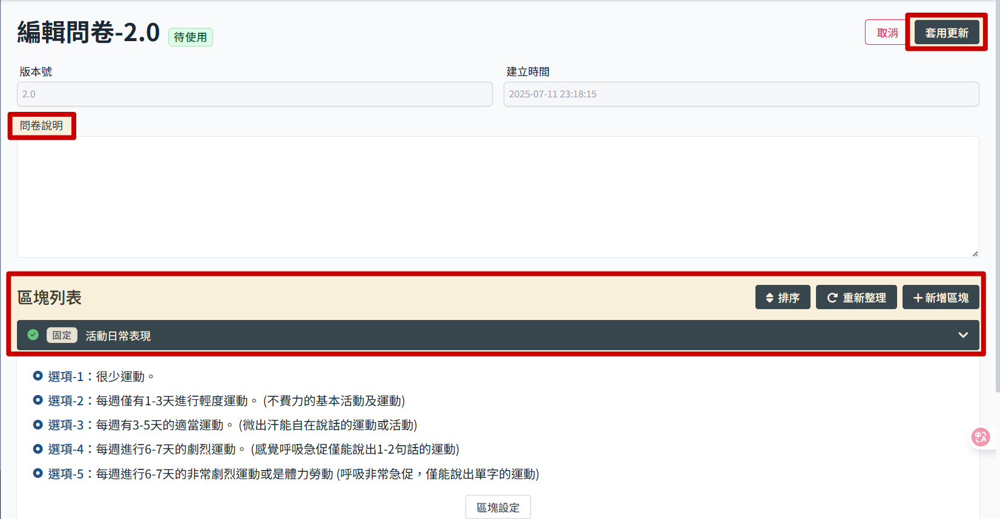
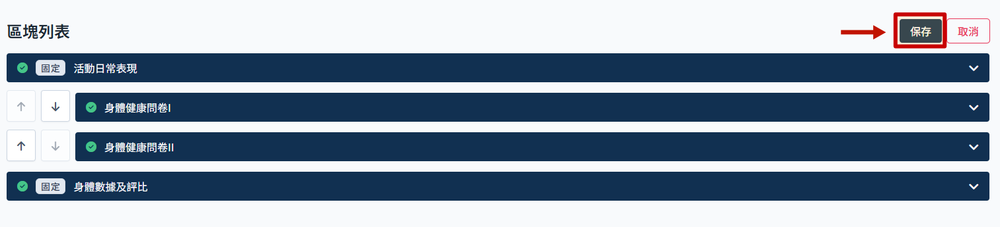

# 編輯問卷內容

> 問卷顯示無狀態的時候才可編輯問卷內容，其餘狀態只能檢視內容。參考 [健康問卷狀態說明](./questionnaire-status.md)。

點擊無狀態的問卷，進入問卷編輯頁面。

## 區塊操作說明

- 問卷可添加說明，版本號及建立時間會由系統自動帶入。
- 做任何變更記得都要點選套用更新。
- 可分為三種不同類型區塊，其中活動日常表現以及身體數據為固定區塊，不可調動順序，也不可刪除，其餘區塊才可新增刪除及排序。

### 活動日常表現

操作參考 [編輯活動日常表現](./daily-block.md)。

### 身體健康問卷（一般區塊）

操作參考 [編輯一般區塊](./normal-block.md)

### 身體數據評比

操作參考 [編輯身體數據區塊](./body-block.md)

## 其他操作

### 區塊排序

日常活動表現與身體數據評比為固定區塊，除此以外的區塊可以調整順序，若沒有特別設定區塊跳轉條件，就是按照排序執行。

:::warning 排序限制
只有一般區塊可以排序。
務必確定區塊內是否有自訂義排序，邏輯是否有衝突。
:::

- 點選 排序
  

- 點擊 箭頭調整順序
  

- 點擊 保存 完成操作
  

### 重新整理功能的使用情況

完成區塊設定後，問卷內容這個頁面問題並不會即時更新，這時候點擊重新整理可刷新問題列表。

