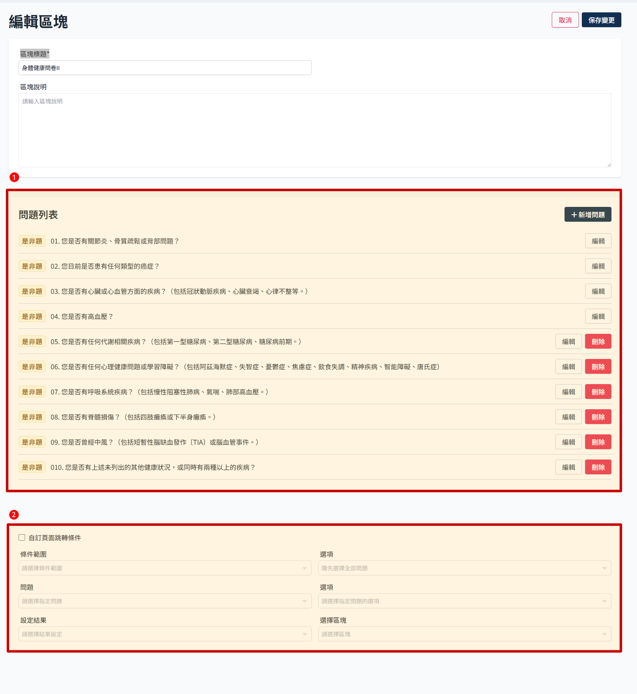
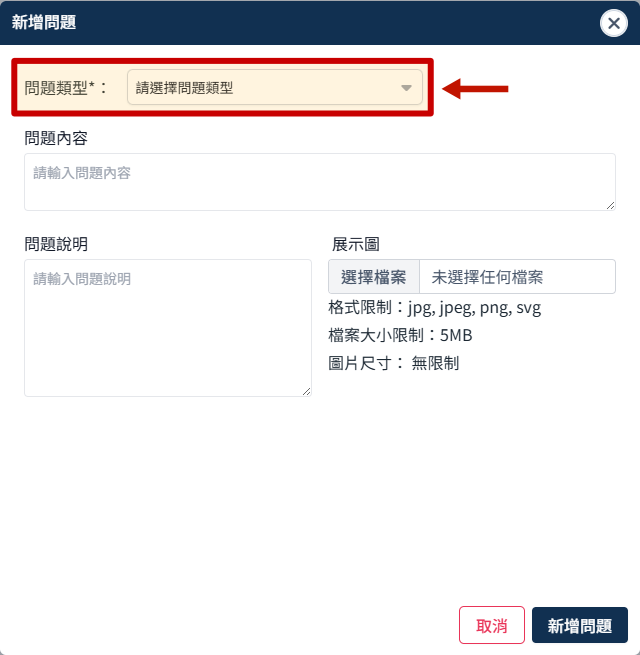
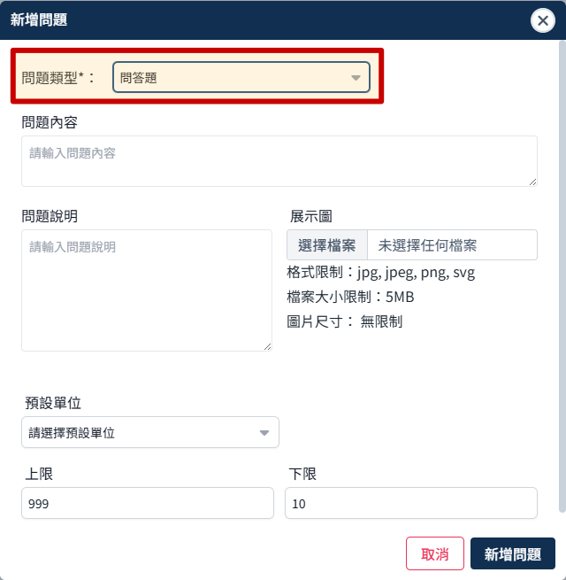
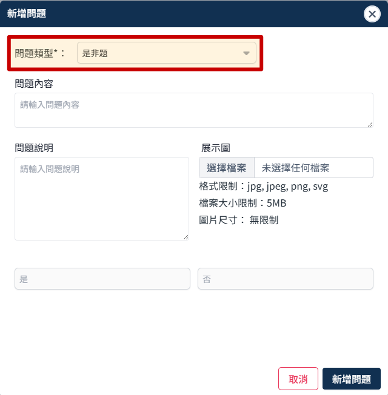
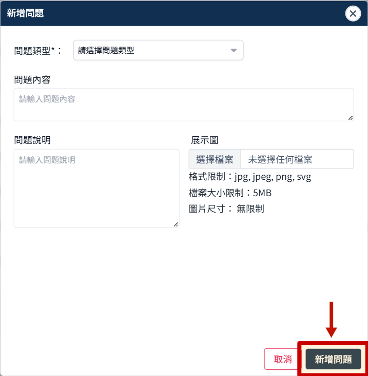
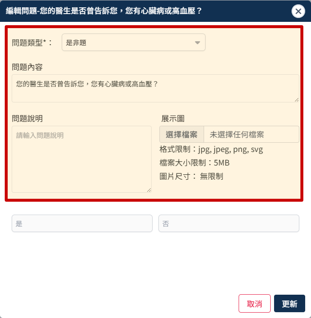
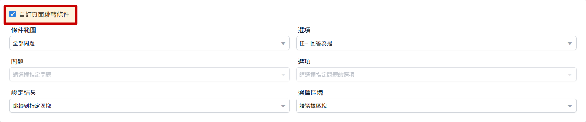

# 編輯一般區塊

身體健康問卷這個區塊即為一般類型，如果有新增區塊的話都會是這種，可以新增不同的問題類型。

- 點選區塊設定
  

- 區塊編輯頁長這樣，大致可分為問題列表以及頁面跳轉條件設定兩個區塊
  

## 基本操作流程

### 新增問題

- 點選 新增問題
  

- 彈窗內可選擇問題類型，會依照類型顯示不同欄位
  
    - 問答題：適合用來詢問身體數據
      
    - 是非題：詢問疾病史與健康狀態
      

- 填寫內容後點選 新增問題
  

### 編輯問題

- 點選 編輯
  

- 原則上與新增問題相同，各項欄位皆可調整
  

### 刪除問題

- 點選 刪除
  

- 彈窗確認，此操作無法復原請謹慎操作
  

## 設定頁面跳轉條件

這裡用來設定問卷的區塊跳轉邏輯，勾選並保存變更後才生效。

:::warning 條件範圍
依照目前提供的需求，僅製作已全部問題為條件範圍的判斷，後續看是否有針對個別問題的需求再進一步開發。
:::
